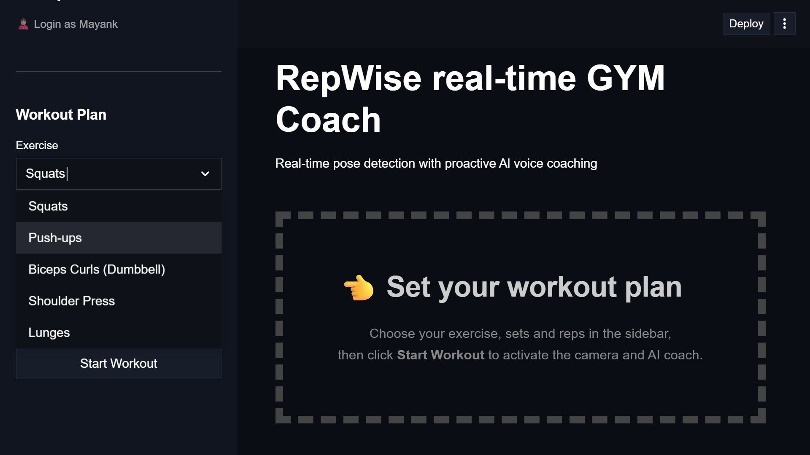
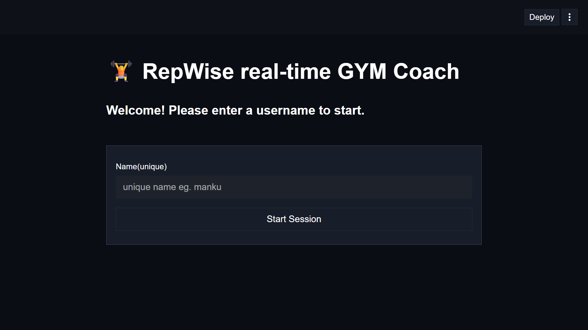
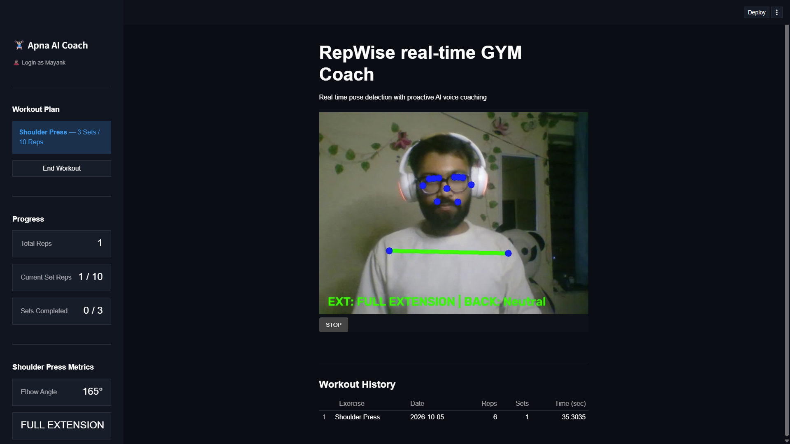

# 🏋️ RepWise - Real-Time AI Gym Coach

<p align="center">
  
</p>

<p align="center">
  <strong>AI-Powered Fitness Coaching using Computer Vision, MediaPipe, and Google Gemini</strong>
</p>

<p align="center">
  Real-time exercise tracking • Form correction • Rep counting • Voice coaching • Workout analytics
</p>

---

## 🚀 Overview

RepWise is an AI-powered fitness coaching application that helps users perform workouts with proper form and technique using real-time computer vision and intelligent voice assistance.

The system analyzes body movements through a webcam using **MediaPipe Pose Landmarker**, tracks repetitions, evaluates exercise form, provides workout analytics, and delivers personalized coaching feedback powered by **Google Gemini AI**.

Whether you're working out at home or in the gym, RepWise acts as your personal AI fitness coach.

---

## 🎥 Demo Video

📹 **Watch RepWise in Action**

👉 **[Demo Video](PASTE_YOUR_VIDEO_LINK_HERE)**

---

## 📸 Application Screenshots

### 🔐 Login Page



Secure user authentication and personalized workout tracking.

---

### 🎯 Real-Time Pose Detection



MediaPipe-powered pose estimation for accurate body landmark detection and movement analysis.

---

### 📊 Workout Dashboard


Monitor repetitions, sets, workout progress, exercise metrics, and AI coaching feedback in real time.

---

## ✨ Features

### 🎥 Real-Time Computer Vision

- Real-time pose estimation
- Human landmark detection
- Joint angle calculation
- Exercise form analysis
- Movement tracking
- Rep counting system
- Set completion detection

### 🏋️ Supported Exercises

#### Upper Body
- Push-Ups
- Shoulder Press
- Biceps Curls

#### Lower Body
- Squats
- Lunges

### 🤖 AI Voice Coach

Powered by Google Gemini AI:

- Exercise guidance
- Form correction suggestions
- Motivational feedback
- Workout completion summaries
- Personalized coaching responses

### 🔊 Voice Feedback

- AI-generated coaching responses
- Workout instructions
- Motivation prompts
- Milestone announcements
- Hands-free coaching experience

### 📈 Workout Analytics

- Total repetitions
- Sets completed
- Exercise duration
- Workout history
- Daily workout summaries

### 🔒 User Authentication

- Secure login system
- Personalized workout history
- User-specific analytics
- Session persistence

---

## 🏗️ System Architecture

```text
Camera Feed
     │
     ▼
MediaPipe Pose Landmarker
     │
     ▼
Landmark Extraction
     │
     ▼
Exercise Detection Layer
     │
 ┌───┼───────────────┐
 ▼   ▼               ▼
Rep Form          Metrics
Count Analysis    Tracking
 └───────┬───────────┘
         ▼
Workout Statistics
         ▼
Google Gemini AI
         ▼
AI Coaching Engine
         ▼
Text-to-Speech
         ▼
Voice Feedback
```

---

## 🛠️ Tech Stack

### Frontend
- Streamlit

### Computer Vision
- MediaPipe
- OpenCV

### Artificial Intelligence
- Google Gemini API
- Prompt Engineering

### Backend
- Python

### Database
- SQLite

### Voice Processing
- gTTS (Google Text-to-Speech)

### Data Processing
- Pandas

---

## 📂 Project Structure

```text
RepWise
│
├── assets/
│   └── images/
│
├── core/
├── detectors/
├── ml_models/
├── services/
├── static/
│
├── main.py
├── requirements.txt
├── data.db
└── README.md
```

---

## ⚙️ Installation

### Clone Repository

```bash
git clone https://github.com/mayankptdr/RepWise-Real-Time-Gym-Coach.git

cd RepWise-Real-Time-Gym-Coach
```

### Create Virtual Environment

```bash
python -m venv .venv
```

### Activate Virtual Environment

#### Windows

```bash
.venv\Scripts\activate
```

#### Linux / macOS

```bash
source .venv/bin/activate
```

### Install Dependencies

```bash
pip install -r requirements.txt
```

### Configure Environment Variables

Create a `.env` file:

```env
GEMINI_API_KEY=YOUR_GEMINI_API_KEY
```

### Run Application

```bash
streamlit run main.py
```

---

## 🎯 Technical Highlights

✅ Real-Time Pose Estimation

✅ Exercise Form Correction

✅ AI-Powered Voice Coaching

✅ Rep Counting Engine

✅ Workout History Tracking

✅ SQLite Integration

✅ MediaPipe Tasks API

✅ Google Gemini Integration

✅ End-to-End Fitness Assistant

---

## 🔮 Future Improvements

- Automatic Exercise Detection
- Personalized Workout Plans
- Calorie Burn Estimation
- Mobile Application
- Cloud Database Integration
- Multi-Person Tracking
- Wearable Device Integration
- AI Performance Scoring

---

## 👨‍💻 Developer

### Mayank Patidar

**B.Tech – Artificial Intelligence & Data Science**  
Lakshmi Narain College of Technology (LNCT), Bhopal

📧 Email: workmayankpatidar@gmail.com

🔗 GitHub: https://github.com/mayankptdr

---

## ⭐ Support

If you found this project useful, please consider giving it a **Star ⭐** on GitHub.

---

<p align="center">
  Built with ❤️ using Python, Computer Vision, MediaPipe, and Generative AI.
</p>
